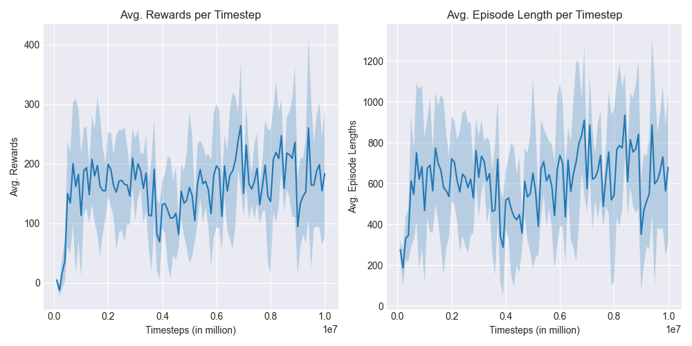

# SurvivorRL (WIP)
A test implementation of reinforcement learning with [godot_rl_agents](https://github.com/edbeeching/godot_rl_agents) in Godot 4 for a custom made survivor game.


## Running
To run training from a binary (exported) game:
```
gdrl --env_path bin/SurvivorRL.exe --config_path ppo-hparams.yaml
```

To run training from the Godot 4 editor:
```
gdrl --noeval
```
and then press play in the editor.


Hyper- and training-parameters can be modified in `ppo-hparams.yaml`.

To test a stored model, adjust `ppo-hparams.yaml` values:

* `deterministic: True`
* `load_path: path/to/model`

Or run with:
```
gdrl --env_path bin/SurvivorRL.exe --config_path ppo-hparams.yaml --load_path save/models/best_model --deterministic
```

## Examples
### Multi-agent training:


https://user-images.githubusercontent.com/57765588/227998221-a1014a97-f767-4eb4-b049-a9d609b4ec5c.mov


### Rewards and episode lengths per time step:




### Testing a trained model
An agent with heavy penalisation for staying near walls and corners (to help the agent learn)

<p align="center">
  
</p>


## Notes
* Increasing the penalty for getting damaged causes the agent to run to a corner and stay there until it dies, without ever learning to run around and dodge enemies.
